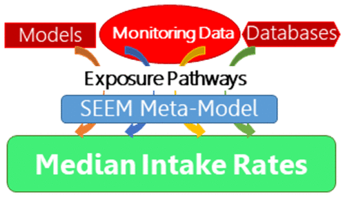

# Systematic Empirical Evaluation of Models (SEEM)

To apply high throughput exposure (HTE) models in a 
human health risk framework
it is necessary to quantify the uncertainty
in the HTE predictions. One recent uncertainty quantification
approach has been to treat chemicals for which monitoring
data are available as representative of chemicals
without such data. In this way, the uncertainty of HTE
predictions for chemicals without biomonitoring data may be estimated
from chemicals with biomonitoring data. The predictions 
can be compared with population
exposure biomonitoring data via toxicokinetic modeling,
for purposes of evaluation and calibration. The ExpoCast project has made use of the
Systematic Empirical Evaluation of Models (SEEM)
framework, as illustrated in the figure (from: https://doi.org/10.1016/j.cotox.2019.07.001):

## General Population Consensus Model (SEEM3)

For SEEM3 chemical structure and physicochemical properties were used to predict the 
probability that a chemical might be associated with any of four exposure pathways 
leading from sources–consumer (near-field), dietary, far-field industrial, and far-field 
pesticide–to the general population. The balanced accuracies of these source-based 
exposure pathway models range from 73 to 81%, with the error rate for identifying 
positive chemicals ranging from 17 to 36%. We then used exposure pathways to organize 
predictions from 13 different exposure models as well as other predictors of human 
intake rates. We created a consensus, meta-model using the SEEM framework in which 
the predictors of exposure were combined 
by pathway and weighted according to predictive ability for chemical intake rates 
inferred from human biomonitoring data for 114 chemicals. The consensus model 
yields an R2 of ∼0.8. This model was only calibrated for the total U.S. population.
<https://doi.org/10.1021/acs.est.8b04056>

## Demographic-Specific Heuristic Model (SEEM2)

For SEEM2 we developed a rapid heuristic method to determine potential human exposure to 
chemicals for application to the thousands of chemicals with little or no exposure data. 
We used Bayesian methodology to infer ranges of exposure consistent with biomarkers 
identified in urine samples from the U.S. population by the National Health and 
Nutrition Examination Survey (NHANES). We performed linear regression on inferred 
exposure for demographic subsets of NHANES demarked by age, gender, and weight using 
chemical descriptors and use information from multiple databases and structure-based 
calculators. Five descriptors are capable of explaining roughly 50% of the variability in 
geometric means across 106 NHANES chemicals for all the demographic groups, 
including children aged 6–11. 
<https://doi.org/10.1021/es503583j>

## External Peer Review

In addition to being described in the peer-reviewed scientific literature these methods were partially reviewed by
a Federal Insecticide, Fungicide, and Rodenticide Act (FIFRA) Scientific Advisory Panel (SAP) on 
"New High Throughput Methods to Estimate Chemical Exposure" in 2014: <https://www.regulations.gov/docket?D=EPA-HQ-OPP-2014-0614>

## Authors

### Principal Investigators 
John Wambaugh [wambaugh.john@epa.gov]
Caroline Ring [ring.caroline@epa.gov]
Kristin Isaacs [isaacs.kristin@epa.gov]
Katherine Phillips [phillips.katherine@epa.gov]
Woodrow Setzer [setzer.woodrow@epa.gov]

### SEEM3 Team
Jon Arnot
Deborah Bennett
Peter Egeghy
Peter Fantke
Lei Huang
Olivier Jolliet
Paul Price
Hyeong-Moo Shin
John Westgate 
<https://doi.org/10.1021/acs.est.8b04056>

### SEEM2 Team 
Anran Wang
Kathie Dionisio
Alicia Frame
Peter Egeghy
Richard Judson
<https://doi.org/10.1021/es503583j>

## License

License: GPL-3 <https://www.gnu.org/licenses/gpl-3.0.en.html>
